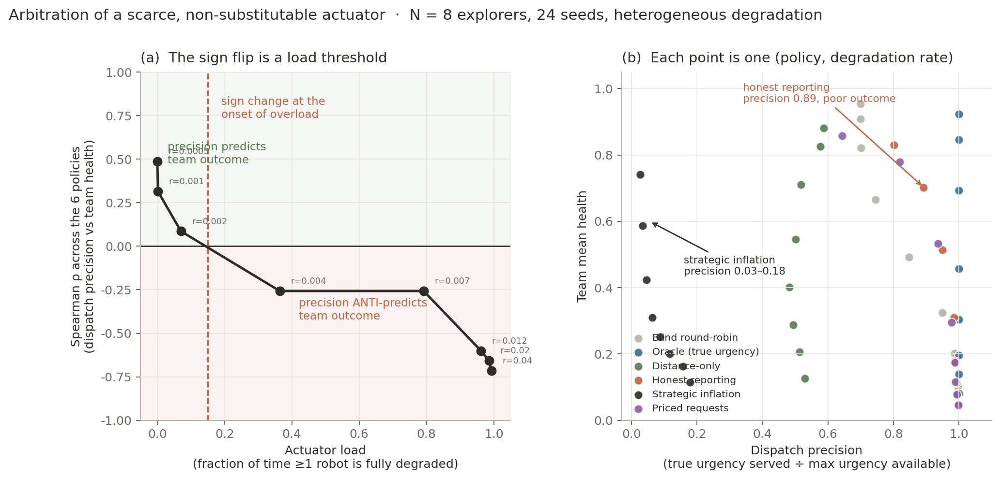
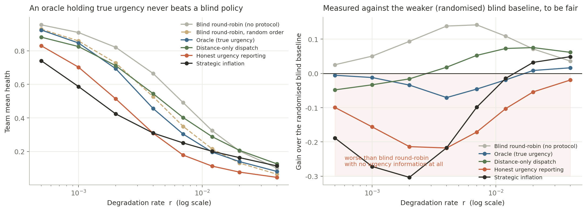
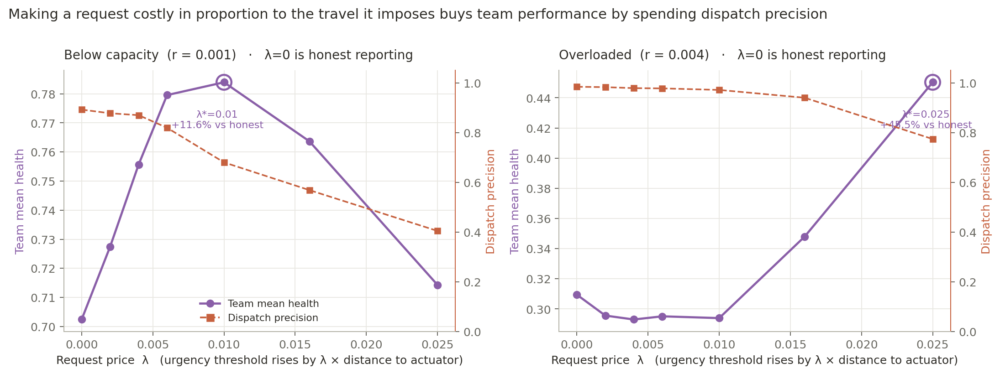

# Arbitration of a scarce, non-substitutable actuator

A minimal model of a question that came out of a multi-robot exploration system:

> **B calls for help. The one actuator that can help sets off toward B. A then calls. Where should it go?**

Everyone writes down *serve the most urgent*. This repository is an attempt to
check whether that rule is right when urgency is **private, noisy, unverifiable
and free to claim** — and when reaching a robot costs travel time.

Everything here runs in about thirty seconds on a laptop. There is no data
dependency and nothing to download.

## The model

N explorers sit at fixed posts on a ring. Explorer *i*'s perception health
*h<sub>i</sub>* decays at its own private rate and is restored to 1 when the single
actuator reaches it and completes a service (5 steps, not interruptible). The
actuator moves at finite speed, so every dispatch decision costs travel. Each
explorer sees only *τ<sub>i</sub> + noise*, where *τ<sub>i</sub> = 1 − h<sub>i</sub>*.
Requesting help is free.

The actuator **re-evaluates its target on every step while travelling**. That is
deliberate: if it could not, the question above would not arise.

Seven policies, differing only in how much urgency information they use:

| policy | behaviour |
|---|---|
| `none` | blind round-robin over posts in spatial order; ignores all requests |
| `none_random` | the same in random order — the weaker, fairer baseline |
| `oracle` | serves the argmax of the **true** urgency vector |
| `nearest` | honest request threshold, but dispatches purely by distance |
| `honest` | explorers report their private estimate; serves the argmax of claims |
| `strategic` | explorers always call and claim the ceiling, so claims tie and the dispatcher falls back on distance |
| `priced` | honest reporting, but an explorer may call only if its urgency exceeds `θ + λ · distance to the actuator` |

## What comes out

**Dispatch precision stops predicting team outcome when the actuator saturates.**
Ranking the policies by dispatch precision (true urgency of the robot served ÷
maximum urgency available) and by team mean health, the Spearman correlation
between the two rankings runs from **ρ = +0.49 below capacity to ρ = −0.71 at
saturation**, crossing zero right at the onset of overload.

**An oracle handed the true urgency vector never beats a policy that ignores
urgency.** This holds across service-to-travel ratios from 1 to 80, degradation
heterogeneity from 0 to 1.6, and two decades of degradation rate. Honest
reporting achieves precision 0.89–0.99 and is simultaneously the worst of the
policies: choosing the most urgent robot usually means choosing a distant one.

Much of this is not new. The travel-side explanation is the Dynamic Traveling
Repairman Problem: Bertsimas and van Ryzin (1991) already show that FCFS-type
disciplines fail to stabilise the system at all stabilisable arrival rates, that
nearest-neighbour policies do well, and that partitioning with cyclic touring is
asymptotically optimal in heavy load. The three best policies here map onto
exactly those classes. Reproducing a 1991 theorem is a sanity check on the
simulator, not a contribution.

What that literature does not cover is that here the demand is **generated by
strategic agents reporting an unverifiable private state**.

**Pricing the request recovers part of the loss.** Charging for a request in
proportion to the travel it imposes gives **+11.6 %** team health over honest
reporting below capacity (λ\* = 0.010) and **+45.5 %** when overloaded
(λ\* = 0.025, at the edge of the sweep and not yet bracketed), while dispatch
precision falls from 0.98 to 0.77. The optimal price rises with load. `λ · d` is
the crudest possible instrument and has no equilibrium behind it.





## Running it

```bash
pip install -r requirements.txt
python -m arbitration.experiments     # ~30 s; writes results/results.json
```

```python
from arbitration import run
run("honest", n=8, rate=0.004, spread=0.6, seed=0, preempt=True).mean_health
```

## Limitations

Fixed posts, no spatial coverage — this is an abstraction of a robot system, not
the system. `none` visits posts in spatial order, which is travel-optimal on a
ring and essentially the DTRP's asymptotically optimal class; `none_random` is
the honest comparison and is 0.03–0.14 worse. The rank correlations are across
six policies, so they are descriptive, not tested. `strategic` is hand-specified
inflation, not a solved equilibrium. λ\* in the overloaded regime is unbracketed.
One noise level only. Re-targeting has no hysteresis, so thrashing counts are
upper bounds.

## Reference

D. J. Bertsimas and G. van Ryzin, "A stochastic and dynamic vehicle routing
problem in the Euclidean plane," *Operations Research*, 39(4):601–615, 1991.

## License

MIT. Hao-Ting (Lex) Ho, 2026 — [github.com/Jadiouo](https://github.com/Jadiouo)
