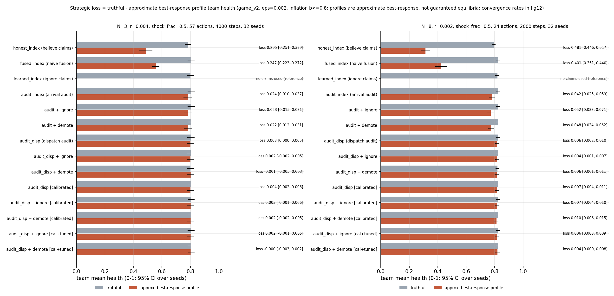
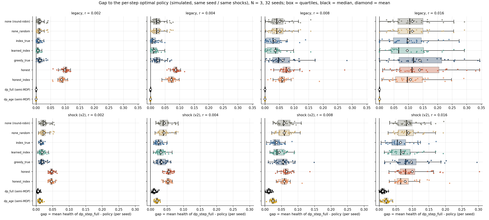
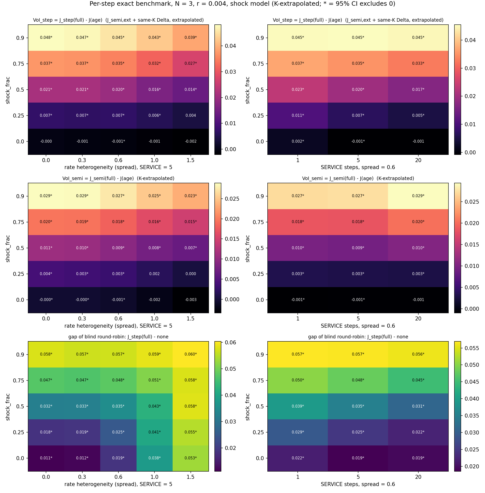
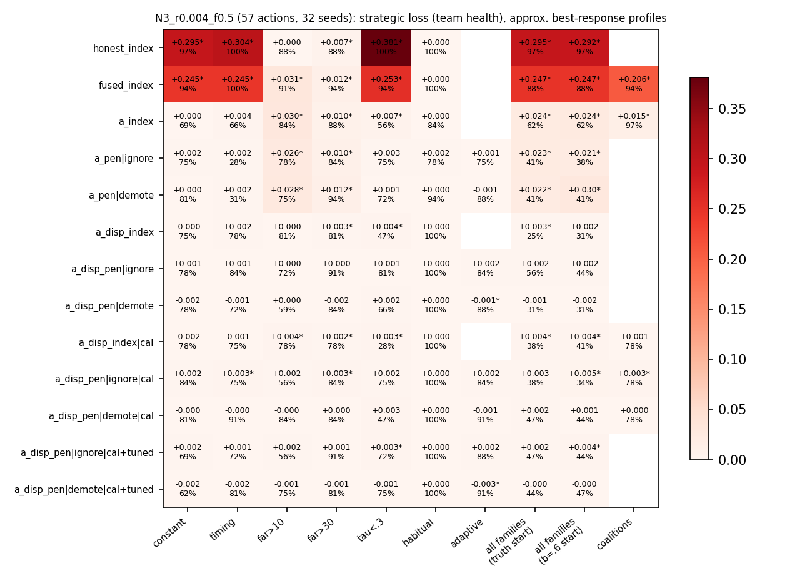

# When to audit a free claim: dispatching a scarce mobile actuator

One actuator serves N decaying explorers on a ring. Explorers report a noisy urgency for free, hidden shocks make health unpredictable from elapsed time, and every dispatch costs travel. This repository studies (1) how much exact perfect state information is worth, and (2) what happens to dispatch rules when explorers report strategically.



**[Live demo](https://jadiouo.github.io/scarce-actuator-arbitration/demo/)** | **[Paper (draft, not peer reviewed)](docs/paper/paper.pdf)** | **[Research log](docs/decisions.md)**

Run the demo locally: `cd docs && python3 -m http.server 8000`, then open <http://localhost:8000/demo/>.

The work uses exact per-step dynamic programming (N <= 3-4) and a GPU simulator. The demo illustrates mechanisms with representative seeds and contains no headline numbers.

- Working paper (draft, not peer reviewed): [`docs/paper/paper.pdf`](docs/paper/paper.pdf) (source: [`docs/paper/paper.tex`](docs/paper/paper.tex))
- Interactive demo: [`docs/demo/index.html`](docs/demo/index.html); the maintainer serves it through GitHub Pages from the `/docs` folder.
- Every claim and its evidence file: [`docs/claims.md`](docs/claims.md).

## How this project was built

The research was done with AI agents. A main agent planned and reviewed the work; subagents implemented code and ran experiments; red-team and white-team agents repeatedly attacked the conclusions and checked for over-optimism. The complete decision record is in [`docs/decisions.md`](docs/decisions.md) (written in Chinese). The author chose the topic and direction and made the final judgments.

## Research process

- [`docs/decisions.md`](docs/decisions.md): decision log (Chinese)
- [`docs/claims.md`](docs/claims.md): each claim and its evidence
- [`docs/preregistration.md`](docs/preregistration.md): internal protocol written mid-project, no external timestamp
- [`docs/literature.md`](docs/literature.md): literature notes
- [`docs/paper/number_audit.md`](docs/paper/number_audit.md): audit of paper numbers against the result JSON

## Key findings

Every number names its cell. Load `r` is the mean decay rate, `f` the shock fraction. "Loss" is truthful team health minus team health at an approximate best-response profile of the finite strategy family (inflation capped at 0.8).

- **Exact value of information (C2).** In plain words: knowing every explorer's true health exactly is worth only a little extra team health, and more when hidden shocks are common. Details: N=3, f=0.5, spread 0.6, service 5, K-extrapolated from (30,60), 32 seeds: VoI_step = 0.012 / 0.019 [0.017, 0.021] / 0.023 / 0.018 at r = .002 / .004 / .008 / .016. Per-load CIs: 0.0120 [0.0104, 0.0135] / 0.0188 [0.0170, 0.0206] / 0.0232 [0.0213, 0.0251] / 0.0181 [0.0154, 0.0207]. It rises monotonically with f (r=.004, spread 0.6, K=(20,30), 16 seeds: 0.006 at f=0.25, 0.045 at f=0.9). The pre-specified (internal protocol) claim H1 (VoI < 0.02) is **not claimed**: it is indistinguishable from the threshold, also at service=1 in the region map (0.024 [0.020, 0.028]); the same setting at shock_frac=0, where theory gives VoI = 0, yields +0.0021 [0.001, 0.003], and after subtracting this bias the CI lower bound is below 0.02; the estimator bias (~0.002) exceeds the margin.
- **Naive trust in reports is costly (C4, H2 holds).** In plain words: if the dispatcher simply believes self-reported urgency, exaggeration costs a lot. Details: `fused_index` loss: 0.247 [0.223, 0.272] at N=3, r=.004, f=.5 (57 actions); 0.40 [0.36, 0.44] at N=8, r=.002, f=.5 (24 actions). This is the known cheap-talk collapse measured quantitatively, not a new phenomenon.
- **Audit timing matters (C5, C6).** In plain words: checking a claim against the truth when the actuator arrives is easy to game; checking at dispatch seems to be harder to game, but the evidence is weaker. Details: An audit at arrival is bypassed by distance-dependent inflation (`audit_index` loss 0.024 [0.010, 0.038] at N=3, r=.004, f=.5; 0.042 [0.025, 0.059] at N=8, r=.002, f=.5). An audit at arrival clearly fails: the loss CI excludes 0 in 9 of 10 cells. An audit at dispatch has a smaller loss within the tested strategy families and a limited best-response search (`audit_disp` 0.0027 [0.0001, 0.0052]; 0.0058 [0.002, 0.010]; about 1/7-1/9 of the arrival audit in the same cell), but the evidence is inconsistent: the CI contains 0 in 5 of the 10 cells (no multiple-comparison correction; in the two main-table cells the lower bound is > 0), and convergence is low (0.25 at N=3, 0.00 at N=8). A non-converged search may miss profitable deviations, so the loss may be underestimated and the ratio is an optimistic estimate for the dispatch audit. The pre-specified claim H4 was refuted and is withdrawn.
- **Corrected earlier claims (C1, C7; C7 exploratory).** In plain words: two claims from the first version did not hold up and were corrected; simple rules ignoring distance do poorly. Details: At N=8 under v2 (1500 steps, 32 seeds, no burn-in), urgency-first `greedy_true` loses to round-robin at every load; without preemption the distance-aware `index_true` wins only at r >= 0.02 (with preemption it also wins at r=.001, .002, .012), and `learned_index`/`honest_index` win significantly only at r=.04. Pricing requests by distance (`priced`) beats the no-thrash baseline by +0.015 to +0.092 (N=8, v2, r=.002 to .016, holdout) but still trails `honest_index` by 0.03-0.08 and `learned_index` by 0.06-0.09: it is a crude distance filter.

## What changed from the first version

The first version of this repository claimed that information is worthless and that pricing a request fixes the problem. Later analysis corrected it:

| first version | now |
|---|---|
| `oracle` was presented as the informed benchmark | Renamed `greedy_true`: it is a myopic greedy rule that ignores travel, not an optimum. The real benchmark is an exact per-step DP. |
| "Information has no value" | Largely an artifact of ignoring distance. Distance-aware rules beat round-robin at high load; exact VoI under hidden shocks is about 0.01-0.02 (N=3) and grows with shock fraction. |
| Request pricing recovers the loss | Much of the original gain was suppression of retargeting thrash (N=8, legacy, fixed lambda). With a tuned lambda* the gain over a no-thrash baseline is +0.015 to +0.092 (N=8, v2), but pricing stays below distance-aware indices: a coarse distance filter. |
| Private information (implicitly) | With deterministic linear decay, elapsed time reveals health, so private information was empty. The v2 model adds hidden Poisson shocks and persistent noise options. |
| Reports were hand-specified (`strategic`) | `strategic` was a placeholder equal to `nearest`. Reporting is now a game solved by approximate best response over finite strategy families, with audit mechanisms. |
| Several robustness sweeps | Those not reproducible from the repository were withdrawn. |

## Model in brief

N explorers sit at fixed posts on a ring (circumference 100); one actuator moves at speed 1. Health decays at private heterogeneous rates (legacy: deterministic linear; v2: part of the decay arrives as hidden Poisson shocks) and is reset to 1 after a 5-step non-interruptible service. Explorers claim urgency + noise (sd 0.15) + a strategic inflation b >= 0. The dispatcher sees only claims and what it observes on arrival. Metric: long-run mean team health after a 500-step burn-in.

## Figures

| | |
|---|---|
|  |  |
| Gap of each policy to the exact per-step DP (N=3, 4) | VoI_step over shock fraction and spread (N=3, r=.004) |
|  |  |
| Truthful vs approximate best-response profile per mechanism | Loss per strategy family |

Exploratory figures (pricing, scaling) are `figures/fig14*` and `figures/fig15*`. Policies versus load under v2: `figures/fig7_v2_load_sweep.png`.

## Reproduction

```bash
pip install -r requirements.txt
# optional, only for the GPU simulator (pick the torch build for your CUDA version):
# pip install -r requirements-gpu.txt
make test            # pytest (sets PYTEST_DISABLE_PLUGIN_AUTOLOAD=1)
make quick           # tiny CPU smoke run
make all             # CPU reference experiments + figures; overwrites results/results.json (long; not re-run for this release)
make replot          # all figures from the existing JSON, no experiments
```
`make test`, `make quick` and `make replot` were run and pass (148 tests; replot reproduces the committed figures byte for byte). `make quick` writes `results/results_quick.json`.

The CPU code (`arbitration/model.py`, `dp.py`, `game.py`) is the reference. The headline experiments were run on a GPU (float64 torch; `arbitration/gpu/` reproduces the CPU simulator seed by seed, max abs difference <= 1.2e-15 in the stored checks; torch is optional and listed in `requirements-gpu.txt`, not in `requirements.txt`; it falls back to CPU torch). Stages:

```bash
python3 scripts/run_dp_step.py checks|gap|region|n4|figs|merge   # -> results/dp_step.json (C2, C3)
python3 scripts/run_game_gpu.py --phase2                         # -> results/game.json, key game_v2 (C4-C6); without --phase2 it runs the older game_sweep
python3 scripts/run_c_pricing.py all                             # -> results/c_pricing.json (C7, exploratory)
python3 scripts/run_d_scaling.py check|calib|health|proxy|games|multi|gref|figs   # -> results/d_scaling.json (C8, exploratory); a stage name is required
python3 scripts/bench_gpu.py dp|dpn4|sim                         # one-off timings
```
The older `game_sweep` key in `results/game.json` is exploratory. The GPU stages need a CUDA GPU and are long-running; only their `--help`/syntax were checked for this release (`run_c_pricing.py`, `run_d_scaling.py` and `bench_gpu.py` have no `--help` and read the first argument as a stage name). Numbers in the paper are audited against the JSON in `docs/paper/number_audit.md`.

## Repository structure

- `arbitration/model.py` legacy and v2 simulator, dispatch rules; `dp.py` semi-MDP benchmark; `game.py` reporting game and audits; `experiments.py`, `figures.py`.
- `arbitration/gpu/` torch simulator, batched DP, per-step DP (`dp_step.py`), game solver, 2-actuator variant, CPU reference for GPU-only features.
- `scripts/` experiment drivers; `results/` evidence JSON; `figures/`; `tests/`; `docs/` (paper, demo, claims, preregistration, decisions, literature).

## Pre-specified protocol and deviations

The protocol was written mid-project, after the stage-A and first stage-B exploratory results, and the H3/H4 cell choices were influenced by them. It has no external timestamp. Treat it as an analysis plan written before the final confirmatory runs, not as a strict pre-registration.

H1 (VoI < 0.02): not claimed. H2 (fused loses to `learned_index`): holds. H3 (arrival audit fails): holds. H4 (dispatch audit has zero loss and max_gain <= 2 eps): refuted, withdrawn. Deviations: only 10 of 27 grid cells were run (nine at N=3, one at N=8 with r=.002, f=.5; N=4 missing); reduced strategy sets in some cells; penalty tuning in one cell; max_gain is an in-sample quantity (stored out-of-sample check only for the N=8 cell: naive in-sample gain 0.075 for `audit_disp|cal` and 0.100 for `audit_index`, out-of-sample 0.0072 and 0.0038); loss baselines differ between hypotheses (H2 against `learned_index`; H3, H4 against each mechanism's own truthful profile). Details: paper Section 8 and `docs/decisions.md`.

## Limitations

DP only for N <= 4; finite strategy families with inflation capped at 0.8; reduced grid and single-cell tuning; single values of shock rate, noise sd (0.15) and AR phi (0.9); health clipped at 0 so losses may partly reflect robot deaths; non-interruptible service; approximate (not always converged) best-response profiles, with convergence rates 0.62 / 0.31 for the arrival audit and about 0 for the N=8 dispatch audit; N>4 conclusions (C8) are exploratory with an unreliable VoI proxy; a ring with fixed posts is not a real robot system.

## References and positioning

C1, C4 and C7 are quantitative checks of known theory, not discoveries: dynamic traveling repairman (Bertsimas and van Ryzin 1991, 1993; Bullo et al. 2011), cheap talk with artificial currencies and audits (Gorokh et al. 2021; Guo et al. 2009; Mylovanov and Zapechelnyuk 2017; Ben-Porath et al. 2014), and tolls (Naor 1969). Cheap talk: Crawford and Sobel 1982; karma: Elokda et al. 2024. Full bibliography in `docs/paper/refs.bib`. What we consider the most defensible contributions: exact per-step VoI with travel coupling and its dependence on shock fraction, and the audit-timing result.

## License

MIT. Hao-Ting (Lex) Ho, 2026 - [github.com/Jadiouo](https://github.com/Jadiouo)
