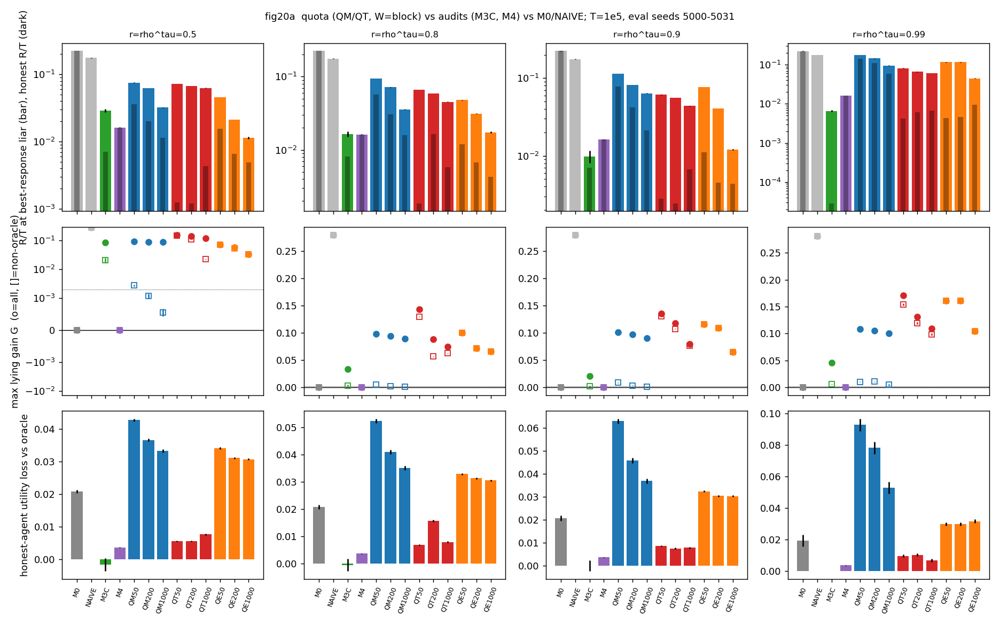
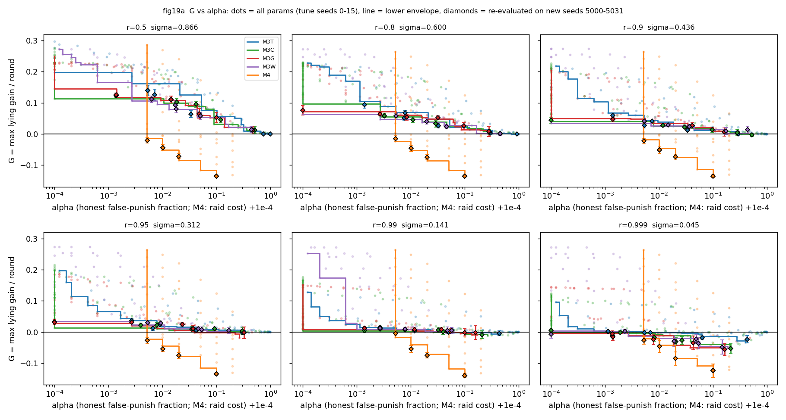

# When to audit a free claim

A scarce server must be shared among agents who report their own urgency for free, and some may exaggerate: Part I studies dispatching a mobile actuator and what exact state information is worth, and Part II studies *when* to audit a claim when the truth can only be checked after a delay.



**[Demo 1: dispatch on a ring](https://jadiouo.github.io/scarce-actuator-arbitration/demo/)** | **[Demo 2: audit timing](https://jadiouo.github.io/scarce-actuator-arbitration/demo2/)** | **[Paper 1 (draft, not peer reviewed)](docs/paper/paper.pdf)** | **[Paper 2: audit timing (draft, not peer reviewed)](docs/direction1-paper/paper.pdf)** | **[Research log](docs/decisions.md)**

Run the demos locally: `cd docs && python3 -m http.server 8000`, then open <http://localhost:8000/demo/> or <http://localhost:8000/demo2/>. Both demos are simplified illustrations with representative seeds; the numbers are in the papers.

## Part I: dispatch and the value of information

One actuator serves N decaying explorers on a ring. Explorers report a noisy urgency for free, hidden shocks make health unpredictable from elapsed time, and every dispatch costs travel. The work uses exact per-step dynamic programming (N <= 3-4) and a GPU simulator. Working paper (draft, not peer reviewed): [`docs/paper/paper.pdf`](docs/paper/paper.pdf), source [`docs/paper/paper.tex`](docs/paper/paper.tex); every claim and its evidence file: [`docs/claims.md`](docs/claims.md).


### Key findings (Part I)

Every number names its cell. Load `r` is the mean decay rate, `f` the shock fraction. "Loss" is truthful team health minus team health at an approximate best-response profile of the finite strategy family (inflation capped at 0.8).

- **Exact value of information (C2).** In plain words: knowing every explorer's true health exactly is worth only a little extra team health, and more when hidden shocks are common. Details: N=3, f=0.5, spread 0.6, service 5, K-extrapolated from (30,60), 32 seeds: VoI_step = 0.012 / 0.019 [0.017, 0.021] / 0.023 / 0.018 at r = .002 / .004 / .008 / .016. Per-load CIs: 0.0120 [0.0104, 0.0135] / 0.0188 [0.0170, 0.0206] / 0.0232 [0.0213, 0.0251] / 0.0181 [0.0154, 0.0207]. It rises monotonically with f (r=.004, spread 0.6, K=(20,30), 16 seeds: 0.006 at f=0.25, 0.045 at f=0.9). The pre-specified (internal protocol) claim H1 (VoI < 0.02) is **not claimed**: it is indistinguishable from the threshold, also at service=1 in the region map (0.024 [0.020, 0.028]); the same setting at shock_frac=0, where theory gives VoI = 0, yields +0.0021 [0.001, 0.003], and after subtracting this bias the CI lower bound is below 0.02; the estimator bias (~0.002) exceeds the margin.
- **Naive trust in reports is costly (C4, H2 holds).** In plain words: if the dispatcher simply believes self-reported urgency, exaggeration costs a lot. Details: `fused_index` loss: 0.247 [0.223, 0.272] at N=3, r=.004, f=.5 (57 actions); 0.40 [0.36, 0.44] at N=8, r=.002, f=.5 (24 actions). This is the known cheap-talk collapse measured quantitatively, not a new phenomenon.
- **Audit timing matters (C5, C6).** In plain words: checking a claim against the truth when the actuator arrives is easy to game; checking at dispatch seems to be harder to game, but the evidence is weaker. Details: An audit at arrival is bypassed by distance-dependent inflation (`audit_index` loss 0.024 [0.010, 0.038] at N=3, r=.004, f=.5; 0.042 [0.025, 0.059] at N=8, r=.002, f=.5). An audit at arrival clearly fails: the loss CI excludes 0 in 9 of 10 cells. An audit at dispatch has a smaller loss within the tested strategy families and a limited best-response search (`audit_disp` 0.0027 [0.0001, 0.0052]; 0.0058 [0.002, 0.010]; about 1/7-1/9 of the arrival audit in the same cell), but the evidence is inconsistent: the CI contains 0 in 5 of the 10 cells (no multiple-comparison correction; in the two main-table cells the lower bound is > 0), and convergence is low (0.25 at N=3, 0.00 at N=8). A non-converged search may miss profitable deviations, so the loss may be underestimated and the ratio is an optimistic estimate for the dispatch audit. The pre-specified claim H4 was refuted and is withdrawn.
- **Corrected earlier claims (C1, C7; C7 exploratory).** In plain words: two claims from the first version did not hold up and were corrected; simple rules ignoring distance do poorly. Details: At N=8 under v2 (1500 steps, 32 seeds, no burn-in), urgency-first `greedy_true` loses to round-robin at every load; without preemption the distance-aware `index_true` wins only at r >= 0.02 (with preemption it also wins at r=.001, .002, .012), and `learned_index`/`honest_index` win significantly only at r=.04. Pricing requests by distance (`priced`) beats the no-thrash baseline by +0.015 to +0.092 (N=8, v2, r=.002 to .016, holdout) but still trails `honest_index` by 0.03-0.08 and `learned_index` by 0.06-0.09: it is a crude distance filter.

### What changed from the first version

The first version of this repository claimed that information is worthless and that pricing a request fixes the problem. Later analysis corrected it:

| first version | now |
|---|---|
| `oracle` was presented as the informed benchmark | Renamed `greedy_true`: it is a myopic greedy rule that ignores travel, not an optimum. The real benchmark is an exact per-step DP. |
| "Information has no value" | Largely an artifact of ignoring distance. Distance-aware rules beat round-robin at high load; exact VoI under hidden shocks is about 0.01-0.02 (N=3) and grows with shock fraction. |
| Request pricing recovers the loss | Much of the original gain was suppression of retargeting thrash (N=8, legacy, fixed lambda). With a tuned lambda* the gain over a no-thrash baseline is +0.015 to +0.092 (N=8, v2), but pricing stays below distance-aware indices: a coarse distance filter. |
| Private information (implicitly) | With deterministic linear decay, elapsed time reveals health, so private information was empty. The v2 model adds hidden Poisson shocks and persistent noise options. |
| Reports were hand-specified (`strategic`) | `strategic` was a placeholder equal to `nearest`. Reporting is now a game solved by approximate best response over finite strategy families, with audit mechanisms. |
| Several robustness sweeps | Those not reproducible from the repository were withdrawn. |

### Model in brief

N explorers sit at fixed posts on a ring (circumference 100); one actuator moves at speed 1. Health decays at private heterogeneous rates (legacy: deterministic linear; v2: part of the decay arrives as hidden Poisson shocks) and is reset to 1 after a 5-step non-interruptible service. Explorers claim urgency + noise (sd 0.15) + a strategic inflation b >= 0. The dispatcher sees only claims and what it observes on arrival. Metric: long-run mean team health after a 500-step burn-in.

### Figures

| | |
|---|---|
|  |  |
| Gap of each policy to the exact per-step DP (N=3, 4) | VoI_step over shock fraction and spread (N=3, r=.004) |
|  |  |
| Truthful vs approximate best-response profile per mechanism | Loss per strategy family |

Exploratory figures (pricing, scaling) are `figures/fig14*` and `figures/fig15*`. Policies versus load under v2: `figures/fig7_v2_load_sweep.png`.

### Pre-specified protocol and deviations

The protocol was written mid-project, after the stage-A and first stage-B exploratory results, and the H3/H4 cell choices were influenced by them. It has no external timestamp. Treat it as an analysis plan written before the final confirmatory runs, not as a strict pre-registration.

H1 (VoI < 0.02): not claimed. H2 (fused loses to `learned_index`): holds. H3 (arrival audit fails): holds. H4 (dispatch audit has zero loss and max_gain <= 2 eps): refuted, withdrawn. Deviations: only 10 of 27 grid cells were run (nine at N=3, one at N=8 with r=.002, f=.5; N=4 missing); reduced strategy sets in some cells; penalty tuning in one cell; max_gain is an in-sample quantity (stored out-of-sample check only for the N=8 cell: naive in-sample gain 0.075 for `audit_disp|cal` and 0.100 for `audit_index`, out-of-sample 0.0072 and 0.0038); loss baselines differ between hypotheses (H2 against `learned_index`; H3, H4 against each mechanism's own truthful profile). Details: paper Section 8 and `docs/decisions.md`.

### Limitations (Part I)

DP only for N <= 4; finite strategy families with inflation capped at 0.8; reduced grid and single-cell tuning; single values of shock rate, noise sd (0.15) and AR phi (0.9); health clipped at 0 so losses may partly reflect robot deaths; non-interruptible service; approximate (not always converged) best-response profiles, with convergence rates 0.62 / 0.31 for the arrival audit and about 0 for the N=8 dispatch audit; N>4 conclusions (C8) are exploratory with an unreliable VoI proxy; a ring with fixed posts is not a real robot system.

### References and positioning

C1, C4 and C7 are quantitative checks of known theory, not discoveries: dynamic traveling repairman (Bertsimas and van Ryzin 1991, 1993; Bullo et al. 2011), cheap talk with artificial currencies and audits (Gorokh et al. 2021; Guo et al. 2009; Mylovanov and Zapechelnyuk 2017; Ben-Porath et al. 2014), and tolls (Naor 1969). Cheap talk: Crawford and Sobel 1982; karma: Elokda et al. 2024. Full bibliography in `docs/paper/refs.bib`. What we consider the most defensible contributions: exact per-step VoI with travel coupling and its dependence on shock fraction, and the audit-timing result.


## Part II: audit timing (direction 1)

**In plain words.** A scarce server can serve only one of three agents per round. Agents say how urgent they are, and one of them may lie. To check a claim the server must wait, and by then the true state has drifted, so even honest agents no longer match their old claims. The question: when and how should the server check, so that lies are caught without punishing the honest? We compared believing reports, auditing on arrival, auditing at dispatch with an accumulating test, quota ("linking") mechanisms that need no verification, and low-probability raids that can hit the winner. Setting for all numbers below, unless stated: K=3, tau=1, T=100000, evaluation seeds 5000-5031 (32 each), mechanism parameters tuned on seeds 0-15. "Gain" G is the liar's mean utility minus its mean utility when honest in the same world (paired seeds), maximised over a hand-written strategy set of 45 strategies, so it is an upward-biased lower bound on what a best-responding liar could get. R/T is the honest agents' regret per round. r = rho^tau; values are +/- the second number in the JSON (about 1.96 standard errors).

**Key findings** (source: [`docs/direction1-paper/`](docs/direction1-paper/paper.pdf), [`docs/direction1-summary.md`](docs/direction1-summary.md); each number is traced to a JSON key in [`docs/direction1-number-audit.md`](docs/direction1-number-audit.md)):

1. **Believing reports, or auditing on arrival, is beaten by lying.** at r=0.5, naive trust gives a maximum gain G = 0.2793 +/- 0.0004 and arrival audit (p=0.1, delta=0, suspension L=20) G = 0.2795 +/- 0.0004, independent of r. A timing liar inflates at decision time and tells the truth when the arrival audit asks.
2. **An audit at dispatch is cheap but only robust against liars that do not know the other claims.** M3C (CUSUM, p=0.1, h=6, L=2500; r=0.9): honest R/T 0.0070 +/- 0.0016, false-punishment rate 0.0303 +/- 0.0060, uninformed max gain 0.0020 +/- 0.0011. An oracle "edge" liar who sees the others' bids still gains 0.0211 +/- 0.0033 at r=0.9 and 0.0870 +/- 0.0053 at r=0.5. It is sensitive to a wrong rho: overestimating r by 0.05 at r=0.9 punishes honest agents at rate 0.3073 +/- 0.0212.
3. **Quota mechanisms block uninformed liars but not oracle liars, and cost efficiency at high persistence.** QM (W=1000, 5 bins): uninformed gain at most 0.0048 +/- 0.0014 (r=0.99), oracle 0.0897 +/- 0.0003 (r=0.5); honest claims are rewritten 4.3% of the time at r=0.5 and 27.0% at r=0.99, and honest R/T rises from 0.0114 +/- 0.0001 to 0.0585 +/- 0.0011.
4. **Low-probability raids that can hit the winner were the most robust in this strategy set.** M4 (epsilon=0.02, L=2500, winner raided with probability 1/3): G = 0.0000 +/- 0.0000 against all 45 strategies at every r, no false punishment, honest R/T 0.0162 +/- 0.0001 (r=0.5) and 0.0162 +/- 0.0002 (r=0.99); each raid wastes one round (0.0200 +/- 0.0002 of rounds). The cost corresponds to travel in the spatial model, which has not been measured. A first version that never raided the winner left a gain of 0.1811 +/- 0.0721 at r=1.
5. **A hoped-for universal scaling law failed.** The gain-versus-noise exponent changes with the false-punishment target (s = 1.26 [1.13, 1.39] at alpha=0.005, 2.18 [1.77, 2.63] at alpha=0.05), so the planned theorem did not hold and the contribution became the empirical map.

**Honesty about the process.** The theory framework was stopped by falsification conditions (F1 to F4) written down before the results were seen. F1 and F3 held, so the framework was abandoned. Those conditions have no external timestamp, so this is not a formal pre-registration. Limits: hand-written strategy sets (oracle strategies dominate, no strategy is proven best), K=3 only, rho assumed known by M3C and QT, and the abstract model is not yet connected back to the ring simulation. Mechanisms and strategy sets are described in [`docs/direction1-summary.md`](docs/direction1-summary.md) (Chinese; the paper is in English).



### Why would a machine misreport?

"Lying" here means directional misreporting: a systematic bias that benefits the reporter. It has at least four sources: robots from different owners sharing a charging station, elevator or landing pad, each tuned for its own owner's performance; learned reporting policies that discover exaggeration through reward hacking; unintentional bias, such as an over-estimating estimator or a conservative threshold, which looks the same to the dispatcher; and faulty or compromised nodes, which are related but outside our model. We do not claim real fleets behave this way; the dispatcher simply cannot tell the sources apart from the reports alone.

## Research process

- [`docs/decisions.md`](docs/decisions.md): decision log (Chinese)
- [`docs/direction1-notes.md`](docs/direction1-notes.md): direction 1 decision notes, including the falsification conditions
- [`docs/direction1-summary.md`](docs/direction1-summary.md): direction 1 results summary and vulnerability map
- [`docs/direction1-number-audit.md`](docs/direction1-number-audit.md) and [`docs/direction1-paper/number_audit.md`](docs/direction1-paper/number_audit.md): every number traced to JSON
- [`docs/paper/number_audit.md`](docs/paper/number_audit.md): Part I number audit
- [`docs/claims.md`](docs/claims.md), [`docs/preregistration.md`](docs/preregistration.md) (internal protocol, no external timestamp), [`docs/literature.md`](docs/literature.md)

## How this project was built

The research was done with AI agents. A main agent planned and reviewed the work; subagents implemented code and ran experiments; red-team agents attacked each conclusion and white-team agents checked for over-optimism. Direction 1 used the same process, with the added step that the white team wrote falsification conditions before the results were seen; the red team then found the loopholes (for example that the raid mechanism never audited the winner) and those were fixed or the claims withdrawn. The decision record is in [`docs/decisions.md`](docs/decisions.md) and [`docs/direction1-notes.md`](docs/direction1-notes.md) (Chinese). The author chose the topics and directions and made the final judgments.

## Reproduction

```bash
pip install -r requirements.txt
# optional, only for the GPU simulator (pick the torch build for your CUDA version):
# pip install -r requirements-gpu.txt
make test            # pytest
make quick           # tiny CPU smoke run
make replot          # all Part I figures from the existing JSON, no experiments
```
Part I stages (GPU, long-running):
```bash
python3 scripts/run_dp_step.py checks|gap|region|n4|figs|merge   # -> results/dp_step.json
python3 scripts/run_game_gpu.py --phase2                         # -> results/game.json
python3 scripts/run_c_pricing.py all                             # -> results/c_pricing.json (exploratory)
python3 scripts/run_d_scaling.py check|calib|health|proxy|games|multi|gref|figs   # -> results/d_scaling.json (exploratory)
```
Part II scripts, all in [`scripts/`](scripts/): `run_adaaudit_2x2.py`, `run_adaaudit_tol.py`, `run_stage2.py`, `run_stage2b.py`, `run_quota.py`, writing to `results/adaaudit_2x2.json`, `adaaudit_tol.json`, `stage2.json`, `stage2b.json` and `quota.json`; the simulators are `arbitration/gpu/adaaudit.py`, `audit_fix.py`, `frontier.py` and `quota.py`. These runs were done on a single GPU with the jobs queued; they were not re-run for this README, so the stored JSON is the reference. The demo logic is in `docs/demo/` and `docs/demo2/` (the latter has a node test, `docs/demo2/tools/test.js`).

## Roadmap

Direction 2 (in progress): train a reinforcement-learning adversary against each deployed mechanism, to replace the hand-written strategy set and test whether the strongest claims (for example that raids leave zero gain) survive a learned best response. Not yet reported.

## Repository structure

- `arbitration/model.py` legacy and v2 simulator, dispatch rules; `dp.py` semi-MDP benchmark; `game.py` reporting game and audits; `experiments.py`, `figures.py`.
- `arbitration/gpu/` torch simulator, batched DP, game solver, and the direction 1 simulators (`adaaudit.py`, `audit_fix.py`, `frontier.py`, `quota.py`).
- `scripts/` experiment drivers; `results/` evidence JSON; `figures/`; `tests/`; `docs/` (papers, demos, notes, decisions).

## License

MIT. Hao-Ting (Lex) Ho, 2026 - [github.com/Jadiouo](https://github.com/Jadiouo)
